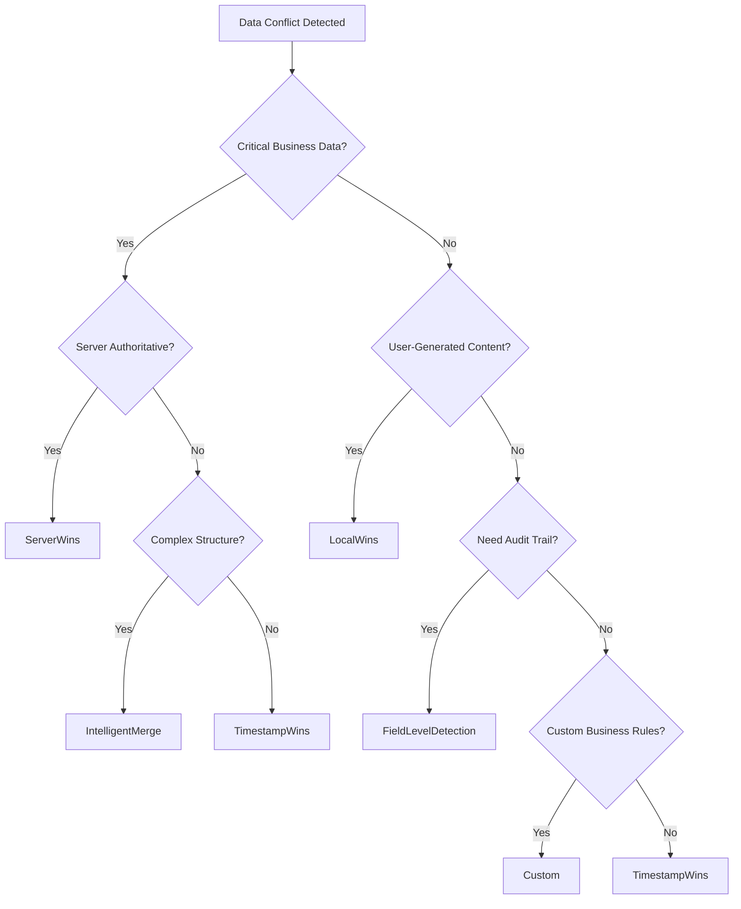

# Universal Sync Manager - Conflict Resolution Strategies Guide

## Overview

Universal Sync Manager (USM) provides six comprehensive conflict resolution strategies to handle data synchronization conflicts across distributed systems. Each strategy serves different use cases and business requirements, ensuring data integrity while maintaining application performance.

## Available Strategies

### 1. 💾 LocalWins Strategy

**Description**: Always prioritizes local (client-side) data over remote (server-side) data.

**When to Use**:
- **Offline-first applications** where user input takes precedence
- **Personal productivity apps** (notes, tasks, documents)
- **Creative applications** where user edits should never be lost
- **Mobile apps** with frequent connectivity issues
- **Draft/working document scenarios**

**Best Practices**:
```dart
// Configure LocalWins for user preference tables
syncManager.registerEntity(
  'user_preferences',
  SyncEntityConfig(
    tableName: 'user_preferences',
    conflictStrategy: ConflictResolutionStrategy.localWins,
    requiresAuthentication: true,
  ),
);
```

**Use Cases**:
- User settings and preferences
- Personal notes and documents
- Draft content creation
- Offline data entry scenarios
- User-specific configurations

---

### 2. 🌐 ServerWins Strategy

**Description**: Always prioritizes remote (server-side) data over local (client-side) data.

**When to Use**:
- **Real-time collaborative systems** requiring authoritative data
- **Financial/critical data** where server validation is essential
- **Centralized configuration** management
- **Compliance-driven applications** with audit requirements
- **Master data management** scenarios

**Best Practices**:
```dart
// Configure ServerWins for critical business data
syncManager.registerEntity(
  'organization_policies',
  SyncEntityConfig(
    tableName: 'organization_policies',
    conflictStrategy: ConflictResolutionStrategy.serverWins,
    requiresAuthentication: true,
  ),
);
```

**Use Cases**:
- Pricing and inventory data
- Security policies
- Organizational configurations
- Compliance requirements
- System-wide settings

---

### 3. 🕒 TimestampWins Strategy

**Description**: Prioritizes data based on modification timestamps - the most recently updated version wins.

**When to Use**:
- **Collaborative editing** where latest changes matter most
- **Event-driven systems** with temporal relevance
- **Log-based applications** requiring chronological order
- **Version control scenarios** with clear modification tracking
- **Real-time updates** with reliable timestamp synchronization

**Best Practices**:
```dart
// Configure TimestampWins for collaborative content
syncManager.registerEntity(
  'shared_documents',
  SyncEntityConfig(
    tableName: 'shared_documents',
    conflictStrategy: ConflictResolutionStrategy.timestampWins,
    requiresAuthentication: true,
  ),
);
```

**Use Cases**:
- Collaborative document editing
- Social media posts and comments
- Project status updates
- Event scheduling
- Activity logs and timelines

**Important Considerations**:
- Requires synchronized clocks across clients
- Network latency can affect timestamp accuracy
- Time zone handling must be consistent

---

### 4. 🧠 IntelligentMerge Strategy

**Description**: Performs field-level analysis to merge non-conflicting changes while applying smart resolution for conflicts.

**When to Use**:
- **Complex data structures** with multiple independent fields
- **User profile management** with diverse attribute types
- **Multi-user editing** of structured data
- **Configuration objects** with orthogonal settings
- **Rich content management** with metadata

**Algorithm**:
1. **Field-by-field comparison** to identify actual conflicts
2. **Non-conflicting fields** are automatically merged
3. **Conflicting fields** use fallback strategy (configurable)
4. **Metadata preservation** (timestamps, versions, etc.)

**Best Practices**:
```dart
// Configure IntelligentMerge for complex data
syncManager.registerEntity(
  'user_profiles',
  SyncEntityConfig(
    tableName: 'user_profiles',
    conflictStrategy: ConflictResolutionStrategy.intelligentMerge,
    requiresAuthentication: true,
  ),
);
```

**Use Cases**:
- User profile management
- Product catalog updates
- Configuration management
- Multi-field form data
- Content with metadata

**Merge Logic**:
- **String fields**: Newest non-empty value
- **Numeric fields**: Highest value or newest
- **Boolean fields**: True takes precedence
- **Array fields**: Union of unique values
- **Object fields**: Recursive merge

---

### 5. 🔍 FieldLevelDetection Strategy

**Description**: Provides granular conflict detection at the field level for precise conflict analysis and custom handling.

**When to Use**:
- **Audit and compliance** requiring detailed conflict tracking
- **Data quality management** with field-specific rules
- **Business rule validation** before conflict resolution
- **Debugging and analytics** for sync behavior analysis
- **Custom conflict resolution** with detailed reporting

**Features**:
- **Precise conflict mapping** at field granularity
- **Conflict categorization** by field type and importance
- **Detailed logging** for audit trails
- **Custom resolution hooks** for business logic
- **Performance optimization** by ignoring non-conflicts

**Best Practices**:
```dart
// Configure FieldLevelDetection for audit tables
syncManager.registerEntity(
  'audit_items',
  SyncEntityConfig(
    tableName: 'audit_items',
    conflictStrategy: ConflictResolutionStrategy.fieldLevelDetection,
    requiresAuthentication: true,
  ),
);
```

**Use Cases**:
- Audit trail maintenance
- Compliance reporting
- Data quality monitoring
- Sync performance optimization
- Conflict analysis and debugging

---

### 6. ⚙️ Custom Strategy

**Description**: Allows implementation of business-specific conflict resolution logic through custom resolver functions.

**When to Use**:
- **Complex business rules** requiring domain-specific logic
- **Multi-criteria decision making** based on business context
- **Priority-based resolution** using custom scoring
- **User interaction required** for conflict resolution
- **Integration with external systems** for validation

**Implementation Pattern**:
```dart
class CustomConflictResolver implements ConflictResolver {
  @override
  SyncConflictResolution resolveConflict(SyncConflict conflict) {
    // Custom business logic here
    if (conflict.fieldConflicts.containsKey('priority')) {
      final localPriority = conflict.localData['priority'] as int? ?? 0;
      final remotePriority = conflict.remoteData['priority'] as int? ?? 0;
      
      // Higher priority wins
      if (localPriority > remotePriority) {
        return SyncConflictResolution.useLocal();
      } else if (remotePriority > localPriority) {
        return SyncConflictResolution.useRemote();
      }
    }
    
    // Fallback to timestamp for other fields
    return SyncConflictResolution.useNewerTimestamp();
  }
}

// Register custom resolver
syncManager.setConflictResolver(
  'custom_entity',
  CustomConflictResolver(),
);
```

**Use Cases**:
- Business priority hierarchies
- User permission-based resolution
- External validation systems
- Complex scoring algorithms
- Interactive conflict resolution

---

## Strategy Comparison Matrix

| Strategy | Performance | Complexity | Data Loss Risk | Use Case Fit |
|----------|-------------|------------|----------------|--------------|
| **LocalWins** | ⚡ Fastest | 🟢 Simple | 🔴 High (Remote) | Offline-first apps |
| **ServerWins** | ⚡ Fastest | 🟢 Simple | 🔴 High (Local) | Authoritative systems |
| **TimestampWins** | 🟡 Fast | 🟡 Medium | 🟡 Medium | Collaborative editing |
| **IntelligentMerge** | 🟡 Medium | 🟠 Complex | 🟢 Low | Complex structures |
| **FieldLevelDetection** | 🟠 Slower | 🟠 Complex | 🟢 Very Low | Audit systems |
| **Custom** | 🔴 Variable | 🔴 Very Complex | 🟢 Configurable | Business-specific |

---

## Implementation Guidelines

### 1. Strategy Selection Framework



### 2. Performance Considerations

**Strategy Performance Ranking** (fastest to slowest):
1. **LocalWins / ServerWins** - Simple preference, no analysis needed
2. **TimestampWins** - Single timestamp comparison
3. **IntelligentMerge** - Field-level analysis and merging
4. **FieldLevelDetection** - Detailed conflict mapping
5. **Custom** - Depends on implementation complexity

### 3. Data Integrity Guidelines

- **High-Risk Data**: Use ServerWins or Custom with validation
- **User Data**: Use LocalWins or IntelligentMerge
- **Collaborative Data**: Use TimestampWins or IntelligentMerge
- **Audit Data**: Use FieldLevelDetection or Custom
- **Configuration**: Use ServerWins or Custom with approval workflow

### 4. Error Handling

```dart
try {
  final resolution = await conflictResolver.resolveConflict(conflict);
  await applyResolution(resolution);
} catch (e) {
  // Fallback to safe strategy
  logger.error('Conflict resolution failed: $e');
  await applyFailsafeStrategy(conflict);
}
```

### 5. Monitoring and Analytics

```dart
// Track conflict resolution metrics
conflictAnalytics.recordResolution(
  strategy: resolution.strategy,
  conflictType: conflict.type,
  fieldsAffected: conflict.fieldConflicts.length,
  resolutionTime: resolution.duration,
);
```

---

## Testing Strategies

### Unit Testing Each Strategy

```dart
group('Conflict Resolution Strategies', () {
  test('LocalWins should preserve local data', () async {
    final result = await testLocalWinsStrategy();
    expect(result.success, true);
    expect(result.chosenData, equals(localData));
  });
  
  test('IntelligentMerge should merge non-conflicting fields', () async {
    final result = await testIntelligentMergeStrategy();
    expect(result.success, true);
    expect(result.mergedFields.length, greaterThan(0));
  });
});
```

### Integration Testing

```dart
test('End-to-end conflict resolution workflow', () async {
  // Create conflicting data
  await createLocalData();
  await createRemoteData();
  
  // Trigger sync and conflict resolution
  final syncResult = await syncManager.syncEntity('test_table');
  
  // Verify resolution
  expect(syncResult.conflicts.isEmpty, true);
  expect(syncResult.resolved.length, greaterThan(0));
});
```

---

## Best Practices Summary

### ✅ Do's

- **Choose strategy based on data criticality** and business requirements
- **Test conflict scenarios** thoroughly in development
- **Monitor conflict frequency** and resolution effectiveness
- **Document strategy choices** and rationale for each entity
- **Implement fallback strategies** for error scenarios
- **Use field-level detection** for audit and compliance requirements

### ❌ Don'ts

- **Don't use LocalWins** for financial or critical business data
- **Don't use ServerWins** for user-generated content without user consent
- **Don't rely on TimestampWins** without synchronized clocks
- **Don't implement Custom strategies** without proper testing
- **Don't ignore conflict resolution** performance impact
- **Don't mix strategies** within the same entity without clear reasoning

### 🔄 Migration Guidelines

When changing conflict resolution strategies:

1. **Backup existing data** before strategy changes
2. **Test new strategy** in staging environment
3. **Gradually migrate** entity by entity
4. **Monitor conflict patterns** after migration
5. **Maintain rollback capability** for critical systems

---

## Conclusion

USM's conflict resolution strategies provide comprehensive coverage for all synchronization scenarios. Choose the appropriate strategy based on your specific requirements, always prioritizing data integrity and user experience. Regular monitoring and testing ensure optimal conflict resolution performance in production environments.

For implementation support and advanced use cases, refer to the USM integration documentation and example implementations in the test suite.